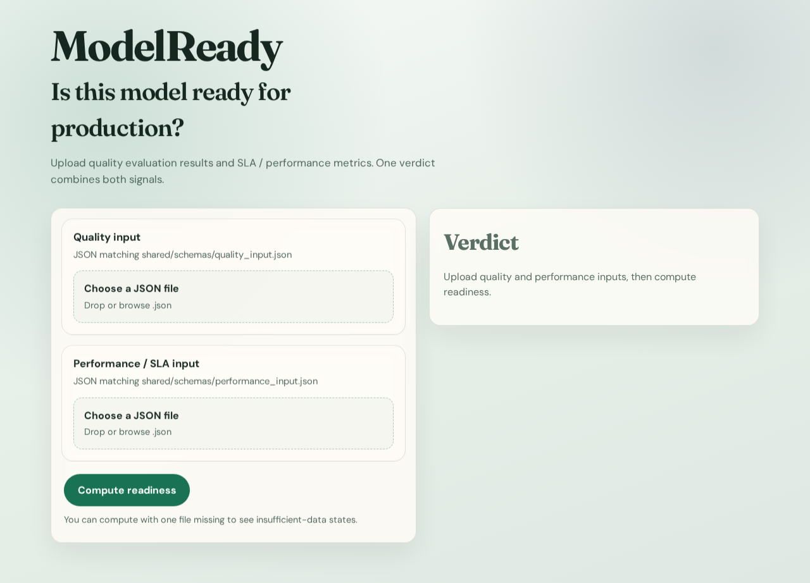
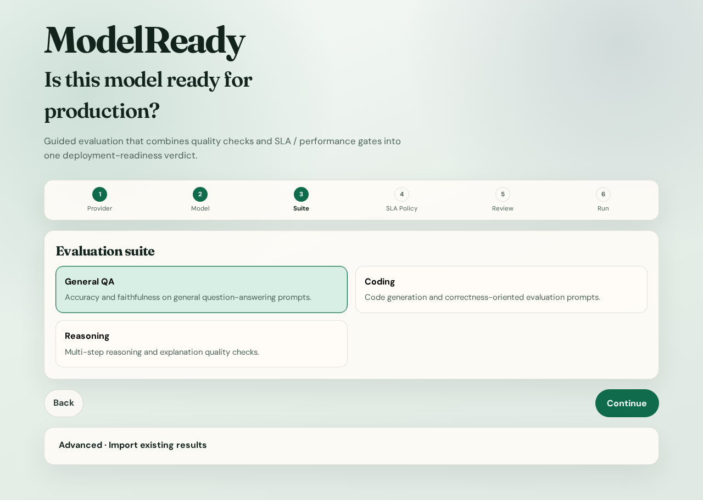
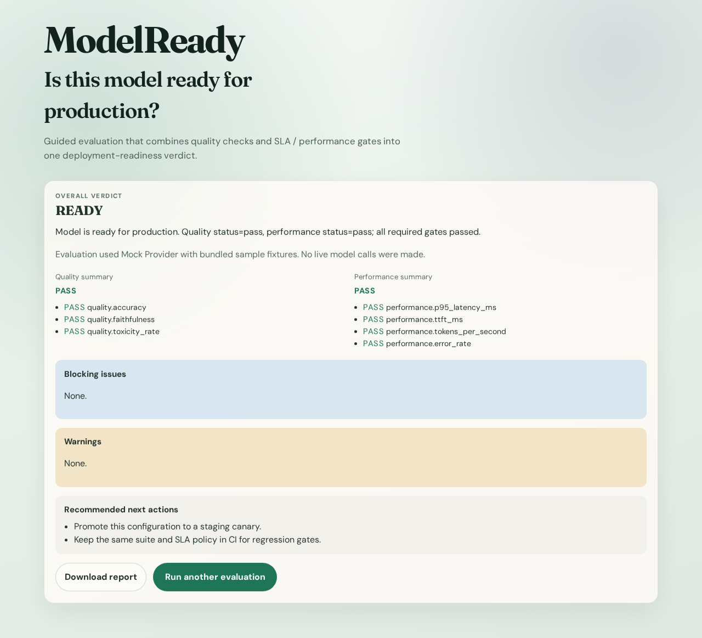

# ModelReady

**ModelReady** is one product that decides whether an LLM is ready for production by combining:

1. **Quality checks** (uploaded evaluation metrics)
2. **SLA / performance checks** (latency, throughput, error rate)

It returns a single `ReadinessReport` with a verdict, explanation, gate details, and missing-data / insufficient-data states.

This is **not** two demos. The UI and API ship as one app.

## What it does (MVP)

1. Upload a quality JSON file  
2. Upload a performance / SLA JSON file  
3. Compute one final verdict: `READY` | `READY_WITH_WARNINGS` | `NOT_READY` | `INSUFFICIENT_DATA`  
4. Read the explanation and gate breakdown  
5. Download the final report as JSON  

Sample payloads live in `shared/sample_data/`.

## Live demo

> **Public URL:** https://modelready.onrender.com  
> Dashboard: https://dashboard.render.com/web/srv-d9kf14n10e5c73b2njtg

Demo path:

1. Open https://modelready.onrender.com  
2. Upload `shared/sample_data/quality_pass.json` and `performance_pass.json`  
3. Click **Compute readiness** → expect `READY`  
4. Click **Download report** to export the JSON  
5. Retry with only one file uploaded → expect `INSUFFICIENT_DATA`

### Screenshots

| Landing | Uploads |
| --- | --- |
|  |  |

| Ready verdict | Insufficient data |
| --- | --- |
|  |  |

## Deployment verification

Verified live on **https://modelready.onrender.com** (Render free Docker web service from `main`):

| Check | Result |
| --- | --- |
| Render service `modelready` (`srv-d9kf14n10e5c73b2njtg`) | Live |
| `GET /health` | `200` `{"status":"ok","service":"modelready"}` |
| `GET /` (UI HTML) | `200` (FastAPI serves the React build) |
| `GET /assets/*.css` and `/assets/*.js` | `200` |
| `POST /api/v1/readiness` with pass samples | `READY` |
| `POST /api/v1/readiness` with quality only | `INSUFFICIENT_DATA` |
| Browser upload → compute → **Download report** | Pass (Playwright) |
| Production JS bundle contains no `localhost` / `127.0.0.1` | Pass (same-origin `/api/v1/readiness`) |

## Architecture

```text
Browser (React + TypeScript)
        │  same origin
        ▼
FastAPI serves /api/* and the built UI
        │
        ▼
shared JSON schemas + readiness engine
        │
        ▼
one ReadinessReport (+ downloadable JSON)
```

Details: [`docs/ARCHITECTURE.md`](docs/ARCHITECTURE.md)

## Repository layout

```text
shared/schemas/       JSON Schema contracts
shared/sample_data/   Example inputs
backend/              FastAPI API + readiness engine
frontend/             React UI
Dockerfile            Single-image public deploy (UI + API)
render.yaml           Render one-service blueprint
docker-compose.yml    Local one-URL stack
.env.example          Environment variable reference
docs/screenshots/     Demo screenshots
```

## Local setup

### Option A — one URL with Docker (closest to production)

```bash
docker compose up --build
```

Open http://127.0.0.1:8080

### Option B — API + Vite separately (faster iteration)

```bash
# terminal 1
cd backend
python3 -m venv .venv
source .venv/bin/activate
pip install -r requirements.txt
uvicorn app.main:app --reload --port 8000

# terminal 2
cd frontend
npm install
npm run dev
```

Open http://127.0.0.1:5173 (Vite proxies `/api` and `/health` to the backend).

## Environment variables

See [`.env.example`](.env.example).

| Variable | Where | Purpose | Default |
| --- | --- | --- | --- |
| `PORT` | Backend / Docker | HTTP listen port | `8000` local API, `8080` Docker/Render |
| `CORS_ORIGINS` | Backend | Allowed browser origins (`*` or comma list) | `*` |
| `STATIC_DIR` | Backend | Built frontend directory for same-origin serve | unset locally; `/app/backend/static` in Docker |
| `VITE_API_BASE_URL` | Frontend build | API origin baked into the UI | empty (same-origin) |

MVP needs **no API keys**.

## Deployment setup (recommended): one public URL on Render

This uses the root `Dockerfile` so the React UI and FastAPI API share one origin.

### Exact steps

1. Ensure `main` includes the latest `Dockerfile`, `render.yaml`, and `.dockerignore`.  
2. Go to [https://render.com](https://render.com) → **New** → **Blueprint**  
   (or open [Deploy to Render](https://render.com/deploy?repo=https://github.com/abhishek-sutaria/ModelReady)).  
3. Connect the `ModelReady` GitHub repository / authorize Render.  
4. Apply the blueprint (`render.yaml` → service `modelready`).  
5. Wait for the Docker build + deploy.  
6. Open the service URL (for example `https://modelready-xxxx.onrender.com`).  
7. Confirm `GET /health` returns `{"status":"ok","service":"modelready"}`.  
8. Paste that URL into the **Live demo** section above.

**Build:** Docker build from repo root (`Dockerfile`).  
**Start:** `./entrypoint.sh` → `uvicorn app.main:app --host 0.0.0.0 --port $PORT`  
**Health:** `GET /health`

### Railway (same Docker image)

1. New project → **Deploy from GitHub**.  
2. Select this repo.  
3. Set builder to **Dockerfile** (root `Dockerfile`).  
4. Set env vars from `.env.example` (`PORT` is usually injected).  
5. Deploy and use the generated public HTTPS URL.

Prefer the single Docker deploy for demos — fewer moving parts, one URL.

## Tests

```bash
# backend
cd backend
source .venv/bin/activate   # or recreate the venv
pip install -r requirements.txt
pytest

# frontend
cd frontend
npm install
npm test
npm run build
```

## Limitations (MVP)

- No authentication or multi-tenant isolation  
- No run history / persistence beyond the current browser session  
- No live model calls — you upload precomputed quality and performance JSON  
- Free Render services may cold-start (first request can be slow)  
- Threshold defaults are intentionally simple and opinionated  

## Sample inputs

| Files | Expected verdict |
| --- | --- |
| `quality_pass.json` + `performance_pass.json` | `READY` |
| `quality_fail.json` + `performance_pass.json` | `NOT_READY` |
| `quality_insufficient.json` + `performance_pass.json` | `INSUFFICIENT_DATA` |
| quality only or performance only | `INSUFFICIENT_DATA` |
